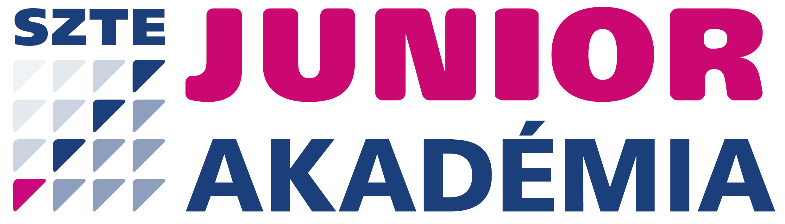

<div class="course-hero">

<div class="course-hero__headline">

<h2>Ötlettől a megvalósításig</h2>


</div>

<p>
A Scup Schoolban <strong>saját, innovatív projektet dolgoztok ki</strong> egy valós, mindennapjainkat érintő tudományos problémára. A projektet személyes csapatmeetingeken keresztül építitek: kiválasztjátok a problémát, kialakítjátok a megoldást, megtervezitek a megvalósítást, majd elkészítitek és beadjátok a pályázati anyagot. A Szent-Györgyi Tanulmányi Verseny adja ehhez a keretet és a célt; közben megtanuljátok, <strong>hogyan válik egy ötletből valódi projekt</strong>.
</p>

</div>


<div class="course-benefits">

<article class="course-benefit">

<h3>10 felvételi pluszpont</h3>

<p>Ha sikeresen teljesítitek a ScupSchoolt és határidőre beadjátok a projekteteket, <strong>minden csapattag 10 SZTE Junior Akadémia felvételi pluszpontot szerezhet</strong>.</p>

<div class="course-benefit__footer">
<a class="course-benefit__footer-link" href="https://juniorakademia.szte.hu/felvetelizoknek/"><span>Felvételi pontokkal kapcsolatos részletek</span></a>
</div>

</article>


<article class="course-benefit">

<h3>A 10 legjobb projekt a döntőben</h3>

<p>A beadott projektek közül a <strong>10 legjobban teljesítő csapat jut be a Szent-Györgyi Tanulmányi Verseny szóbeli döntőjébe</strong>.</p>

<div class="course-benefit__footer">
<a class="course-benefit__footer-link" href="https://u-szeged.hu/szgytv/felhivas"><span>Az SZGYTV hivatalos honlapja</span></a>
</div>

</article>

</div>


<div class="course-info-wrap">

<a class="course-info-card" href="course/how-course-works.html">
<i class="bi bi-journal-text" aria-hidden="true"></i>
<span class="course-info-card__text">A kurzus részleteit, a projekttel kapcsolatos elvárásokat és az értékelési szempontrendszert a kurzusleírásban találjátok.</span>
<span class="course-info-card__cta">Kurzusleírás megnyitása <span aria-hidden="true">→</span></span>
</a>

</div>

<div class="roadmap-introduction">

## Így épül a projektetek, lépésről lépésre

A hét modul egymásra épül: minden új szakaszban továbbviszitek azt, amit korábban létrehoztatok. Az **ajánlott befejezési időpontok** abban segítenek, hogy egyenletesen haladjatok, és az utolsó napokra már csak a véglegesítés és a beadás maradjon.

Haladjatok sorrendben, és mindig azt a modult nyissátok meg, amelyiken éppen dolgoztok.

</div>


```{r}
#| echo: false
#| output: asis

manifest <- read.csv(
  "dev/course-manifest.csv",
  fileEncoding = "UTF-8",
  stringsAsFactors = FALSE,
  check.names = FALSE
)

manifest <- manifest[
  order(manifest$module_number, manifest$page_order),
]

homepage_modules <- data.frame(
  module_number = 1:7,
  project_phase = c(
    "Kiválasztjátok azt a tudományos témát, amelyből közösen elindítjátok a projekteteket.",
    "A tág témából kiválasztotok egy konkrét problémát, amelyre a projekteteket építitek.",
    "Több lehetséges irányból kiválasztjátok azt a projektötletet, amelyet közösen továbbfejlesztetek.",
    "A projektötletből működő tervet készítetek, és végiggondoljátok a megvalósítás feltételeit.",
    "Kidolgozzátok a projekt részleteit, és elkészítitek a pályázati adatlap végleges tartalmát.",
    "A kész projektből meggyőző bemutatást építetek: elkészítitek a pitchet, a onepager első változatát és a vizuális irányt.",
    "Befejezitek és ellenőrzitek a teljes pályázati csomagot, majd határidőre beadjátok."
  ),
  date_label = c(
    rep("Ajánlott befejezés", 6),
    "Beadási határidő"
  ),
  date = c(
    "szeptember 14.",
    "szeptember 24.",
    "október 5.",
    "október 11.",
    "október 19.",
    "október 26.",
    "október 31."
  ),
  stringsAsFactors = FALSE
)

escape_html <- function(x) {
  x <- gsub("&", "&amp;", x, fixed = TRUE)
  x <- gsub("<", "&lt;", x, fixed = TRUE)
  x <- gsub(">", "&gt;", x, fixed = TRUE)
  x <- gsub('"', "&quot;", x, fixed = TRUE)
  x
}

module_numbers <- sort(unique(manifest$module_number))

cards_html <- character()

for (module_number in module_numbers) {

  module_rows <- manifest[
    manifest$module_number == module_number,
  ]

  overview <- module_rows[
    module_rows$page_type == "overview",
  ]

  homepage_row <- homepage_modules[
    homepage_modules$module_number == module_number,
  ]

  stopifnot(
    nrow(overview) == 1,
    nrow(homepage_row) == 1
  )

  module_title <- escape_html(
    module_rows$module_title[[1]]
  )

  project_phase <- escape_html(
    homepage_row$project_phase[[1]]
  )

  date_label <- escape_html(
    homepage_row$date_label[[1]]
  )

  date <- escape_html(
    homepage_row$date[[1]]
  )

  module_url <- sub(
    "\\.qmd$",
    ".html",
    overview$relative_path[[1]]
  )

  card_html <- sprintf(
    paste0(
      '<a class="module-card" href="%s">',
      '<div class="module-card__header">',
      '<span class="module-card__number">%d</span>',
      '<div>',
      '<div class="module-card__eyebrow">%d. modul</div>',
      '<h3>%s</h3>',
      '</div>',
      '</div>',
      '<p class="module-card__summary">%s</p>',
      '<div class="module-card__date">',
      '<i class="bi bi-clock" aria-hidden="true"></i>',
      '<span class="module-card__date-label">%s</span>',
      '<span class="module-card__date-value">%s</span>',
      '</div>',
      '<div class="module-card__open">',
      '<span>Modul megnyitása</span>',
      '<span aria-hidden="true">→</span>',
      '</div>',
      '</a>'
    ),
    module_url,
    module_number,
    module_number,
    module_title,
    project_phase,
    date_label,
    date
  )

  cards_html <- c(cards_html, card_html)
}

cat(
  "```{=html}\n",
  '<div class="module-map">\n',
  paste(cards_html, collapse = "\n"),
  "\n</div>\n",
  "```\n",
  sep = ""
)
```

## Gyors elérés

:::: {.operative-grid}

::: {.operative-card}

### Hogyan működik a kurzus?

A kurzus működésével és felépítésével kapcsolatos általános információk.

[Kurzusműködés megnyitása](course/how-course-works.qmd)

:::


::: {.operative-card}

### Határidők és beadás

A kurzus határidői és a beadáshoz kapcsolódó információk.

[Határidők megnyitása](course/deadlines.qmd)

:::


::: {.operative-card}

### Segítségtár

Opcionális segítség a projektmunka során felmerülő helyzetekhez.

[Segítségtár megnyitása](support/index.qmd)

:::


::: {.operative-card}

### Gyakori kérdések

Válaszok a kurzus szervezésével, működésével és technikai használatával
kapcsolatos kérdésekre.

[GYIK megnyitása](course/faq.qmd)

:::

::::