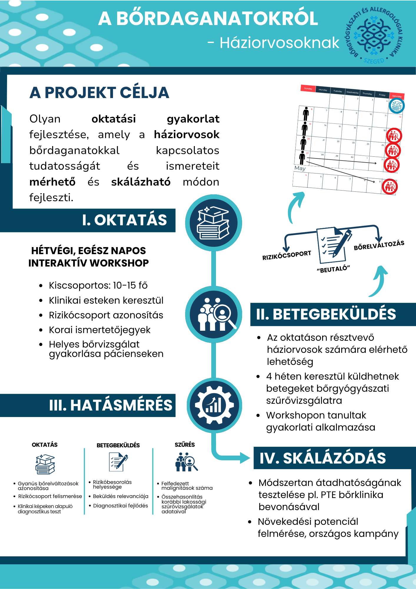

<!-- BEGIN GENERATED MODULE NAVIGATION -->
<div class="module-page-utility">
<a class="module-page-utility__overview" href="index.html">← Moduláttekintő</a>
<span class="module-page-utility__position" aria-label="Oldal helye a modulban">7 / 11</span>
</div>
<nav class="module-page-navigation" aria-label="Modulon belüli navigáció">
<a class="module-page-navigation__link module-page-navigation__link--previous" href="05-probald-ki-hangosan.html"><span class="module-page-navigation__label">Előző</span><span class="module-page-navigation__title">← Próbáld ki hangosan</span></a>
<a class="module-page-navigation__link module-page-navigation__link--next" href="07-egy-kis-technikai-segitseg.html"><span class="module-page-navigation__label">Következő</span><span class="module-page-navigation__title">Egy kis technikai segítség →</span></a>
</nav>
<!-- END GENERATED MODULE NAVIGATION -->

A pitchben három percetek van arra, hogy valaki megértse a projekt lényegét és kíváncsi legyen rá. A **onepager ugyanezt a kihívást oldja meg vizuálisan**: egyetlen oldalon kell olyan képet adnia a projektről, amelyből gyorsan kiderül, miről szól, miért fontos és mit szeretnétek megvalósítani.

Hasonló formátum sok területen előkerül. Kutatók egyetlen poszteren foglalnak össze hosszú kutatásokat, egy új ötlet vagy projekt bemutatásakor pedig gyakran egy rövid vizuális összefoglaló az első anyag, amellyel valaki találkozik.

A kihívás ugyanaz, mint a pitchnél: **választani kell**.

## Egy oldalra nem fér rá minden

A pályázati adatlapban sok részletet kidolgoztatok. Ha ezt a teljes szöveget kisebb betűkkel rápréselitek egy oldalra, éppen az vész el, amiért a onepager hasznos: hogy valaki gyorsan átlássa a projektet.

Egy jó onepagerből általában érdemes megérteni:

- mi a projekt neve;
- milyen problémára reagál;
- kinek szól;
- mit találtatok ki;
- hogyan működik;
- milyen változást szeretnétek elérni.

Ha van egy különösen erős adat, kép, mondat vagy más vizuális elem, amely segít megérteni a projektet, annak is lehet helye.

**Ezek kapaszkodók, nem kötelező dobozok.** A projektetek dönti el, melyik információnak mekkora hangsúlyra van szüksége.

## Nézz meg egy valódi példát

Mielőtt részletesen végigolvasnád, nézz rá néhány másodpercig az alábbi onepagerre.

**Mit tudsz meg a projektről pusztán abból, ahogyan az oldal fel van építve?**

```{=html}
<figure class="onepager-example">

<div class="onepager-example__eyebrow">Valós projektpélda</div>

<a
  class="onepager-example__image-link"
  href="../../assets/images/module-06/onepager-bordaganatok.png"
  aria-label="A bőrdaganatokról szóló onepager megnyitása teljes méretben"
>
  
</a>

<figcaption class="onepager-example__caption">
  <strong>A bőrdaganatokról – háziorvosoknak</strong>
  <span>Kattints a képre, ha teljes méretben szeretnéd megnézni.</span>
</figcaption>

</figure>
```

Ez egy valódi, kutatási háttérből kinőtt projektterv onepagere. A projekt ötlete dr. Papp Benjamin melanóma-kutatáshoz kapcsolódó munkájából indult az SZTE Bőrgyógyászati és Allergológiai Klinikával együttműködésben, Hornyák Teodóra orvostanhallgató pedig a szakdolgozatában dolgozott a kutatáson és a projekt részletes megtervezésén.

A projekt végül idő- és erőforráshiány miatt még nem valósult meg. Ettől a onepager szempontjából még teljes értékű példa: **egy jól kidolgozott projektterv lényegét kellett gyorsan érthetővé tenni egy kívülálló számára.**

::: {.learning-block .learning-block--reflect}
<div class="learning-block__title">Gondold végig</div>

Nézd meg újra az oldalt, és figyeld meg:

- **Mihez megy először a szemed?**
- **Hogyan vezet végig az oldal a projekt fő részein?**
- **Melyik információ kap sok helyet, és melyik fér el kisebb területen?**
:::

A onepager nem azonos méretű dobozokba rendezi a projekt összes elemét. A projekt célja nagy hangsúlyt kap, utána pedig a vizuális sorrend végigvezet az **oktatás → betegbeküldés → hatásmérés → skálázódás** folyamatán.

A méret, a hely, a címsorok, a színek és az összekötő vizuális elemek együtt mutatják meg, milyen sorrendben érdemes olvasni az oldalt.

Érdemes azt is megfigyelni, hogy a **hatásmérés** részben sok információ került viszonylag kis területre. Itt már több figyelem kell az olvasáshoz. Ez jól mutatja, mi történik, amikor egy onepager egy részére túl sok tartalmat próbálunk elhelyezni.

Ez a példa **egy lehetséges megoldás**, nem követendő sablon. A saját projektetekhez egészen más elrendezés működhet jól.

## Először döntsétek el, mi kerüljön rá

A színekkel, betűtípusokkal, képekkel és elrendezéssel sokkal könnyebb dolgozni, ha már világos, mit szeretnétek elmondani az oldalon.

::: {.learning-block .learning-block--try}
<div class="learning-block__title">Próbáld ki</div>

Elsőként gyűjtsetek rövid **vázlatpontokat** ehhez a kérdéshez:

**Mit kell mindenképpen megértenie annak, aki csak ezt az egy oldalt látja a projektünkből?**

Nézzétek meg utána:

- mi ismétlődik;
- melyik gondolat túl részletes;
- mi az, ami nélkül már nehéz lenne megérteni a projektet;
- van-e olyan adat, kép vagy mondat, amely különösen sokat segít.

A végére maradjon az a néhány gondolat, amelyből már kialakul egy világos kép a projektetekről.
:::

A onepager szövege általában tömörebb lesz, mint a pályázati adatlapé. Érdemes a tartalmat egy gyorsan olvasó ember számára újrafogalmazni: rövid szövegrészekben, világos címekkel és könnyen megtalálható kulcsgondolatokkal.

## Egy ronda papírvázlat is lehet nagyon hasznos

Ha már nagyjából tudjátok, milyen tartalom kerüljön az oldalra, próbáljátok meg egy papírlapon elhelyezni.

Rajzoljatok néhány dobozt, és jelöljétek be, hol lehet például:

- a projekt neve;
- a legfontosabb üzenet;
- a probléma;
- a projekt lényege;
- egy fontos kép vagy adat;
- a várható hatás.

**Nem kell szépen kinéznie.** A cél az, hogy gyorsan kiderüljön, mi kap túl sok helyet, mi hiányzik, és milyen sorrendben találkozik az olvasó az információkkal.

Van, aki először a szöveget rakja össze, más rögtön vizuálisan gondolkodik, és olyan is, akinek egy Canva-sablon segít elindulni. Használjátok azt a munkamódot, amelyikkel a leggyorsabban láthatóvá válik az oldal szerkezete.

## A grafika vezesse a szemet

Ha a tartalom és az első elrendezés már összeállt, jöhet a vizuális finomítás.

A onepagernek néhány másodperc alatt jeleznie kell:

**Mit nézzek meg először? → Mi a legfontosabb? → Merre haladjak tovább?**

Ehhez sokszor már néhány egyszerű döntés elég: eltérő betűméret, jól elkülönülő címsorok, következetes színek, elegendő üres hely és világos vizuális sorrend.

::: {.related-support}
<div class="related-support__label">Kapcsolódó segítség</div>

### [Grafikus tervezés kisokos](../../support/grafikus-tervezes-kisokos/index.qmd)

Itt találtok segítséget a vizuális hierarchiához, a színek és betűtípusok kiválasztásához, valamint a Canva egyszerű használatához.
:::

## A modul végére legyen legalább egy vázlatotok

::: {.learning-block .learning-block--important}
<div class="learning-block__title">Fontos</div>

A hatodik modul végére:

- legyen világos, **mi kerüljön a onepagerre**;
- a szöveges tartalma lényegében álljon össze;
- és legyen legalább egy **első vizuális vázlat vagy mockup**, amellyel tovább tudtok dolgozni.

A színeket, az elrendezést, a tipográfiát és az apró grafikai részleteket később még finomíthatjátok. A fontos az, hogy addigra már tudjátok, **mit szeretnétek ezen az egy oldalon elmondani a projektetekről**.
:::

A következő oldalon visszatérünk a pitchvideóhoz, és megnézzük, **milyen egyszerű technikai előkészületekkel tudtok használható felvételt készíteni a meetingen**.

<!-- BEGIN GENERATED MODULE BOTTOM NAVIGATION -->
<nav class="module-page-navigation module-page-navigation--bottom" aria-label="Modulon belüli navigáció az oldal végén">
<a class="module-page-navigation__link module-page-navigation__link--previous" href="05-probald-ki-hangosan.html"><span class="module-page-navigation__label">Előző</span><span class="module-page-navigation__title">← Próbáld ki hangosan</span></a>
<a class="module-page-navigation__link module-page-navigation__link--next" href="07-egy-kis-technikai-segitseg.html"><span class="module-page-navigation__label">Következő</span><span class="module-page-navigation__title">Egy kis technikai segítség →</span></a>
</nav>
<!-- END GENERATED MODULE BOTTOM NAVIGATION -->

